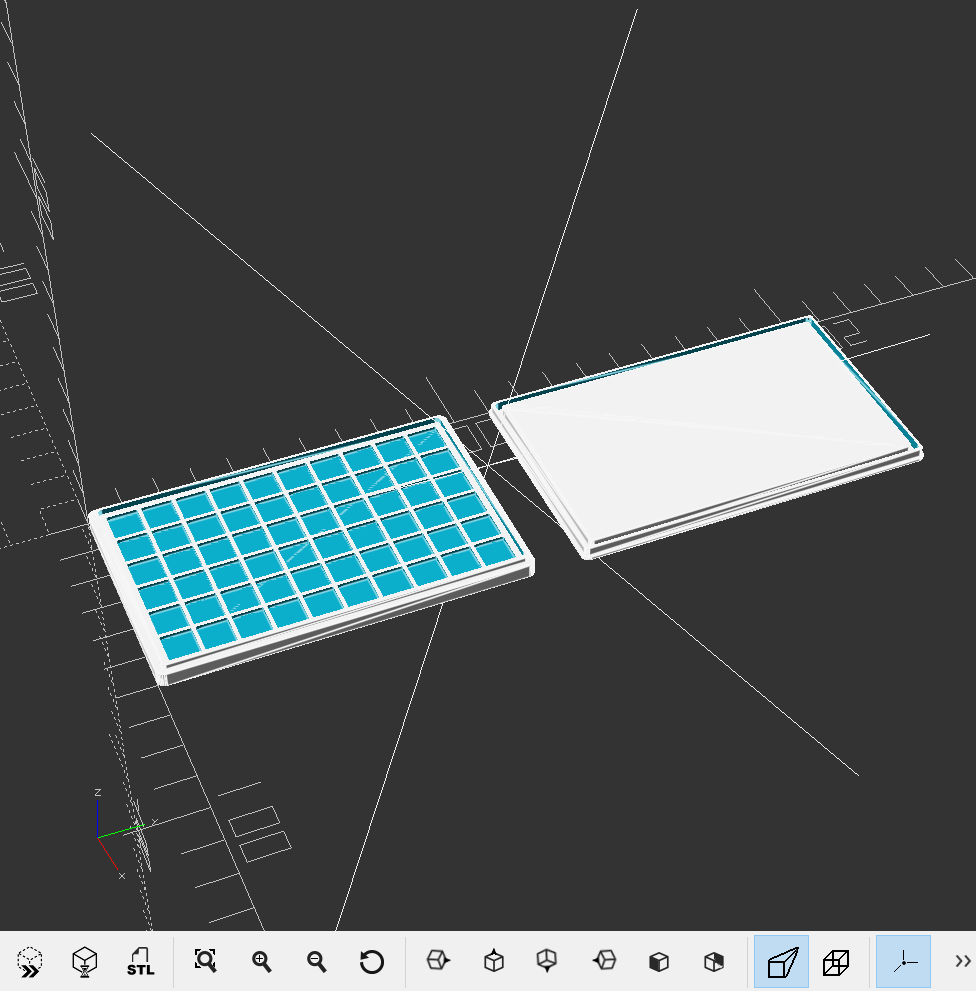

## iCEBox
This is a tray can storage your chips in.

## Make your own
Simply to use as this,
```scad
use <lib/icebox.scad>

icebox(
  // the title
  title    = ["STM32", 5],

  // the description
  subtitle = ["F401CCU6", 5],

  // declare your chip package size
  // 7.5mm *7.5mm * 1.0mm
  chip   = [7.5, 7.5, 1],

  // declare how many chips you want to store
  count  = [5,  5],

  // pad size for the title
  padsz  = 18
);

```

and your iCEBox will come out! :P


I guess you're can't wait to print then enjoy it XD.

## LICENSE
Licensed under the MIT license with ❤.
